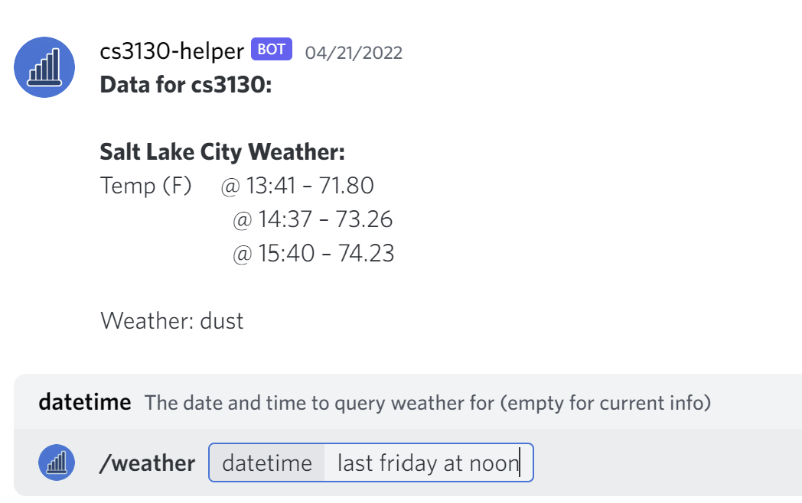
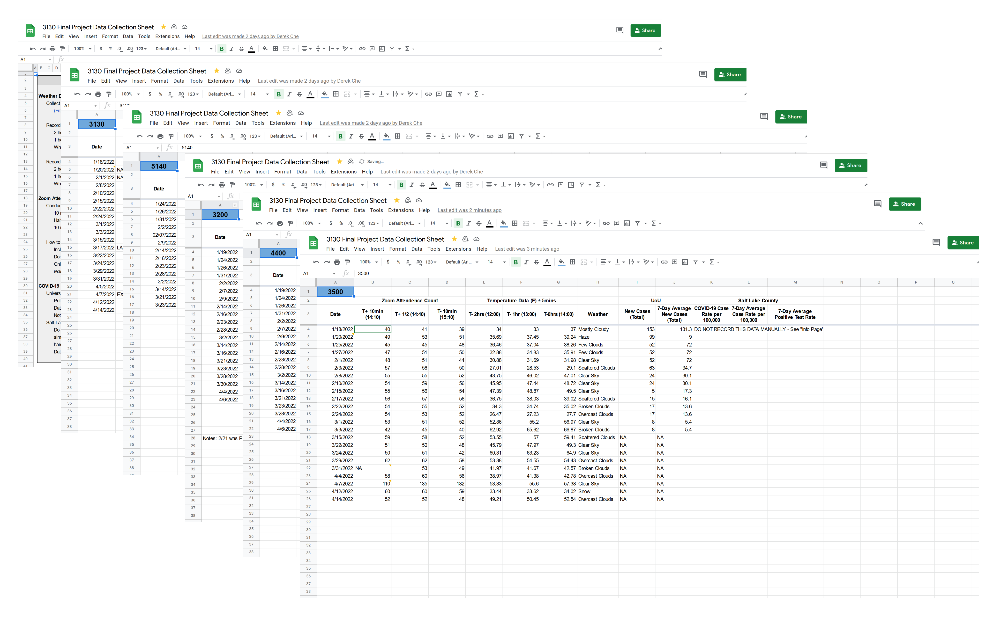

```{r install-packages, message=FALSE, warning=FALSE, include=FALSE}
# code snippet from:
# https://vbaliga.github.io/verify-that-r-packages-are-installed-and-loaded/
## If a package is installed, it will be loaded. If any
## are not, the missing package(s) will be installed
## from CRAN and then loaded.

## First specify the packages of interest
packages <- c("fontawesome", "dplyr",
              "ggplot2", "plotly",
              "GGally", "lazyeval")

## Now load or install & load all
package_check <- lapply(
  packages,
  FUN = function(x) {
    if (!require(x, character.only = TRUE)) {
      install.packages(x, dependencies = TRUE)
      library(x, character.only = TRUE)
    }
  }
)
```

# Introduction

## Our Questions

- Hybrid Computer Science Courses at the University of Utah
  - Do COVID case numbers affect Zoom lecture attendance?
  - Does weather affect Zoom lecture attendance?

# Gathering Data

## Operationalization

- Weather
    - type (☀️, ☁️, ☔, ❄️, etc.)
    - temperature (T-2, T-1, T-0)
- COVID ({ width=22 }<span style="color:#cc0000">Univ. of Utah</span>, Salt Lake County)
    - Daily case numbers
    - 7-day average

## Collection: Scraper

- [Scraper](https://github.com/bessex/cs3130-project-helper)
    - `r fa("docker", fill = "steelblue")` [Docker-ized](https://www.docker.com/)
    - `r fa("node-js", fill = "#43853d")` Built with [Node.js](https://nodejs.org)
    - `r fa("discord", fill = "#738adb")` Reports to [Discord](https://discord.com), ✨_automatically_✨
    - Pulls weather from [OpenWeatherMap](https://openweathermap.org/current)
    - ~~Pulls~~ _Pulled_ from [{ width=22 } COVID Central](https://coronavirus.utah.edu/)

---

{ width=100% }


## Collection: Zoom Attendance

{ width=100% }

## Collection: Zoom Attendance

- Zoom attendence recorded via Zoom headcount
- Recorded at
    - 10 min after start
    - Half-way
    - 10 min before end
- Minus one for professor
- Minus one for researcher (us)
- Left TAs in the count

## Collection: University of Utah Covid Data

- Available on U of U Covid information page
- Total new cases and 7-day average new cases
    - Among faculty, staff, and students
- U of U stopped posting data on March 3rd
    - Couldn't get data retroactively
- Scraper used to collect data

## Collection: Salt Lake County Covid Data

- COVID-19 data downloaded from the [{ width=22 } COVID Central](https://coronavirus.utah.edu/)
    - Daily new case counts
    - 7-day average new cases
    - 7-day average percent positive test rate
- Used Salt Lake County entries

## Weather Data

- Collected from [OpenWeatherMap](https://openweathermap.org/current)
- Weather type (☀️, ☁️, ☔, ❄️, etc.)
    - Collected 2hrs before class started
- Temperature
    - Collected 0hrs, 1hr, and 2hrs before class
    - Average daily temperature
- Used scraper to collect data

## Temperature

```{r, message=FALSE, warning=FALSE, echo=FALSE}
gData = read.csv("./data/3130 Final Project Data Sheet - Mean Atd Rate, Mean Daily Temp, & COVID-19.csv")
gData$date = as.Date(gData$date_2, format = "%m/%d/%Y")
accumulate_by <- function(dat, var) {
  var <- lazyeval::f_eval(var, dat)
  lvls <- plotly:::getLevels(var)
  dats <- lapply(seq_along(lvls), function(x) {
    cbind(dat[var %in% lvls[seq(1, x)], ], frame = lvls[[x]])
  })
  dplyr::bind_rows(dats)
}
gData = gData %>% accumulate_by(~date)
pAvgTemp = ggplot(gData, aes(x=date, y=mean_daily_temp, frame=frame)) + geom_line() + labs(title="Mean Daily Temperature Between Jan 18, 2022 to Mar 24, 2022", x = "Date", y = "Temperature (F)") + geom_smooth(method = "lm")
ggplotly(pAvgTemp) %>% 
  animation_opts(
    frame = 100, 
    transition = 0, 
    redraw = FALSE
  ) %>%
  animation_slider(
    currentvalue = list(
      prefix = "Date"
    )
  )
```

## Mean Daily COVID Case Rates

```{r, message=FALSE, warning=FALSE, echo=FALSE}
pAvgTemp = ggplot(gData, aes(x=date, y=daily_confirmed_case_count)) + geom_line() + labs(title="Mean Daily COVID Case Counts Between Jan 18, 2022 to Mar 24, 2022", x = "Date", y = "Case Counts") + geom_smooth(method = "loess")
ggplotly(pAvgTemp)
```

## COVID Positive Test Rate 7 Day Average

```{r, message=FALSE, warning=FALSE, echo=FALSE}
pAvgTemp = ggplot(gData, aes(x=date, y=positive_test_rate_7d_avg)) + geom_line() + labs(title="Positive Test Rate 7 Day Average Between Jan 18, 2022 to Mar 24, 2022", x = "Date", y = "Positive Test Rate") + geom_smooth(method = "loess")
ggplotly(pAvgTemp)
```

## Zoom Attendance Data


```{r, message=FALSE, warning=FALSE, echo=FALSE}
library(ggplot2)
library(plotly)
par(mar = c(4, 4, .1, .1))
attData = read.csv("./data/3130 Final Project Data Sheet - Atd & Weather.csv")
attData$date = as.Date(attData$date, format = "%m/%d/%Y")
courseAttData = split(attData, f=attData$course)
p3130 <- ggplot(courseAttData$`3130`, aes(x=date, y=mean_atd)) + geom_line() + geom_smooth(method = "lm", se=FALSE)
p3200 <- ggplot(courseAttData$`3200`, aes(x=date, y=mean_atd)) + geom_line() + geom_smooth(method = "lm", se=FALSE)
p3500 <- ggplot(courseAttData$`3500`, aes(x=date, y=mean_atd)) + geom_line() + geom_smooth(method = "lm", se=FALSE)
p4400 <- ggplot(courseAttData$`4400`, aes(x=date, y=mean_atd)) + geom_line() + geom_smooth(method = "lm", se=FALSE)
p5140 <- ggplot(courseAttData$`5140`, aes(x=date, y=mean_atd)) + geom_line() + geom_smooth(method = "lm", se=FALSE)
fig = subplot(p3130, p3200, p3500, p4400, p5140, nrows=3, margin=0.07, titleY = TRUE) %>%
  layout(title = "Mean Zoom Attendance Between Jan 18, 2022 to Mar 24, 2022 for Courses")
ann = list(list(x = 0.2 , y = 1.01, text = "CS 3130", showarrow = F, xref='paper', yref='paper'),
           list(x = 0.85 , y = 1.01, text = "CS 3200", showarrow = F, xref='paper', yref='paper'),
           list(x = 0.15 , y = 0.61, text = "CS 3500", showarrow = F, xref='paper', yref='paper'),
           list(x = 0.85 , y = 0.61, text = "CS 4400", showarrow = F, xref='paper', yref='paper'),
           list(x = 0.15 , y = 0.21, text = "CS 5140", showarrow = F, xref='paper', yref='paper')
           )
fig = fig %>% layout(annotations = ann)
fig
```

## Analysis (1/3)

Data

- Zoom attendance
- Daily new case counts SL County
- 7-day average new case count SL County
- 7-day average positive test rate SL County
- Average daily temperature SL City

## Analysis (2/3)

- Mean Daily Attendance Rate
    - Aggregated course Zoom attendance into single attendance rate for each day
- Pearson correlation coefficient calculated
- Fisher transformation applied to yield a normally distributed variable
- 95% confidence interval calculated for each correlation coefficient

## Analysis Results? (3/3)

- Mean Atd Rate vs Mean Daily Temperature
    - CC: -0.0392 & CI: -0.3725, 0.3029
- Mean Atd Rate vs Daily Confirmed New Case Count in SL County
    - CC: -0.1932 & CI: -0.4987, 0.1551
- Mean Atd Rate vs 7-Day Average Confirmed New Case Count in SL County
    - CC: -0.1064 & CI: -0.4291, 0.2404
- Mean Atd Rate vs 7-Day Average Positive Test Rate in SL County
    - CC: -0.0472 & CI: -0.3793, 0.2957

No correlation? Inconclusive?

## Analysis (2/?) <!-- Begin Ben's section -->

A different approach. 🤠 Data wrangling:

<!-- 
# compute mean attendance and propagate NA
# compute attendance rate based on number enrolled
# convert course into a factor
# convert weather into a factor
# make date R-readable
# compute mean of temps 2 hours before class 
-->

```{r}
data <- read.csv("data/atd_weather_full.csv") %>%
    rowwise() %>%
    mutate(mean_atd = mean(c(atd_start, atd_mid, atd_end))) %>%
    mutate(atd_rate = mean_atd / enrolled) %>%
    mutate(course = factor(course)) %>%
    mutate(weather = factor(weather)) %>%
    mutate(date = as.Date(date, "%m/%d/%Y")) %>%
    mutate(mean_temp = mean(temp_tm2, temp_tm1, temp_tm0, na.rm = TRUE))
```

---

First, Zoom attendance rate versus mean temp:

```{r, message=FALSE, warning=FALSE, echo=FALSE}
# filtering down to a choice few variables
data_filtered <- data %>%
    select(date, course, atd_rate, mean_temp,
           uu_new_cases, uu_new_cases_7da)

data_filtered %>%
    ggplot(aes(mean_temp, atd_rate, color = course)) +
    geom_point() +
    geom_smooth(method = "lm") +
    scale_color_manual(values = c("3130" = "purple",
                                  "3200" = "red",
                                  "5140" = "green",
                                  "3500" = "orange",
                                  "4400" = "blue"))
```

---

Zoom attendance rate versus the 7-day average of new COVID cases at the { width=22 }:

```{r, message=FALSE, warning=FALSE, echo=FALSE}
data_filtered %>%
    ggplot(aes(uu_new_cases_7da, atd_rate, color = course)) +
    geom_point() +
    geom_smooth(method = "lm") +
    scale_color_manual(values = c("3130" = "purple",
                                  "3200" = "red",
                                  "5140" = "green",
                                  "3500" = "orange",
                                  "4400" = "blue"))
```

---

So, does this mean me might see relationships within individual classes?

...

_Let's find out!_

## Analysis (?/?)

3200, 3500, and 4400 look promising: we'll make a plot matrix:

```{r}
p3500 <- data_filtered %>%
    filter(course == 3500) %>%
    select(!course) %>%
    ggpairs() +
    theme(axis.text.x = element_text(angle = 90, hjust = 1),
          axis.title = element_text(size = rel(0.85))) +
    labs(title = "3500 Pairs")
```

_(repeat as needed)_

```{r, include=FALSE}
p3200 <- data_filtered %>%
    filter(course == 3200) %>%
    select(!course) %>%
    ggpairs() +
    theme(axis.text.x = element_text(angle = 90, hjust = 1),
          axis.title = element_text(size = rel(0.85))) +
    labs(title = "3200 Pairs")

p4400 <- data_filtered %>%
    filter(course == 4400) %>%
    select(!course) %>%
    ggpairs() +
    theme(axis.text.x = element_text(angle = 90, hjust = 1),
          axis.title = element_text(size = rel(0.85))) +
    labs(title = "4400 Pairs")
```

---

```{r, message=FALSE, warning=FALSE, out.height="550px", out.width="750px", fig.height=10, fig.width=10, echo=FALSE}
ggplotly(p3500)
```

---

```{r, message=FALSE, warning=FALSE, out.height="550px", out.width="750px", fig.height=10, fig.width=10, echo=FALSE}
ggplotly(p3200)
```

---

```{r, message=FALSE, warning=FALSE, out.height="550px", out.width="750px", fig.height=10, fig.width=10, echo=FALSE}
ggplotly(p4400)
```

## Conclusions! ...maybe?

```{r, include=FALSE}
# define dyplyr-able function to calcuate R^2
rsq <- function(.data, x, y) {
    rsq_(.data, lazyeval::lazy(x), lazyeval::lazy(y))
}

# define corrolary function_ since we're using non-standard evaluation (NSE)
rsq_ <- function(.data, x, y) {
    require(lazyeval)
    summary(lm(lazy_eval(x, .data)~lazy_eval(y, .data)))$r.squared
}

# bonus:
# define dyplyr-able function to calculate Pearson correlation coefficient
cor <- function(.data, x, y) {
    cor_(.data, lazyeval::lazy(x), lazyeval::lazy(y))
}

# define corrolary function_ since we're using non-standard evaluation (NSE)
cor_ <- function(.data, x, y) {
    stats::cor(x = lazyeval::lazy_eval(x, .data),
               y = lazyeval::lazy_eval(y, .data),
               use = "complete.obs")
}
```

- Zoom Attendance Rate vs. Mean Temp
    - CS 3500: ($p > 0.05$) -- Not significant.
    - CS 3200: $`r data %>% filter(course == 3200) %>% cor(mean_temp, atd_rate) %>% round(3)`,\ R^2 = `r data %>% filter(course == 3200) %>% rsq(mean_temp, atd_rate) %>% round(3)`$ ($p < 0.01$)
    - CS 4400: $`r data %>% filter(course == 4400) %>% cor(mean_temp, atd_rate) %>% round(3)`,\ R^2 = `r data %>% filter(course == 4400) %>% rsq(mean_temp, atd_rate) %>% round(3)`$ ($p < 0.01$)

---

- Zoom Attendance Rate vs. 7-day Avg Cases at { width=22 }
    - CS 3500: $`r data %>% filter(course == 3500) %>% cor(mean_temp, atd_rate) %>% round(3)`,\ R^2 = `r data %>% filter(course == 3500) %>% rsq(mean_temp, atd_rate) %>% round(3)`$ ($p < 0.001$)_!!_
    - CS 3200: $`r data %>% filter(course == 3200) %>% cor(mean_temp, atd_rate) %>% round(3)`,\ R^2 = `r data %>% filter(course == 3200) %>% rsq(mean_temp, atd_rate) %>% round(3)`$ ($p < 0.01$)
    - CS 4400: ($p > 0.05$) -- Not significant.

## Conclusions? ...perhaps not.

- Limitations too great to make assertions...
